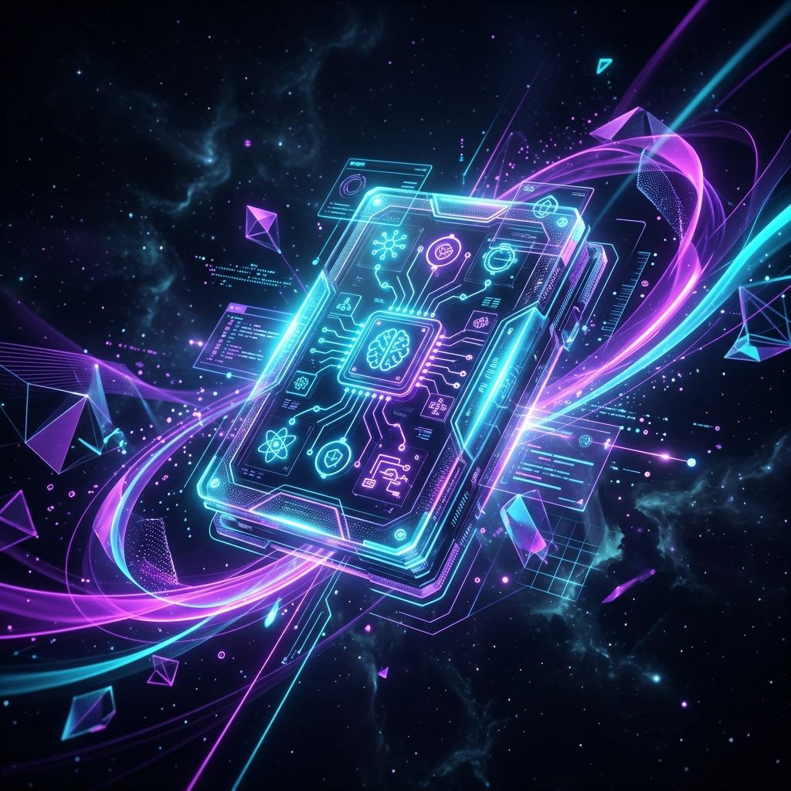
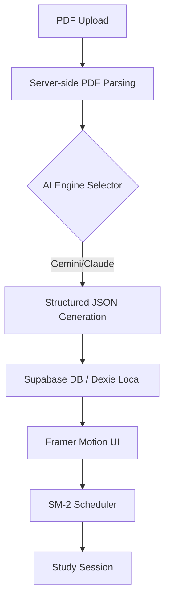

# 

<div align="center">

# ⚡ FlashForge
### The Next-Generation AI Flashcard Engine
*Transform complex PDFs into intelligent, study-ready flashcards in seconds.*

[](https://nextjs.org/)
[](https://tailwindcss.com/)
[](https://supabase.com/)
[](https://deepmind.google/technologies/gemini/)
[](https://www.typescriptlang.org/)

[Features](#-features) • [Installation](#-installation) • [Tech Stack](#-tech-stack) • [Architecture](#-architecture)

</div>

---

## ✨ Features

- **🚀 Multimodal AI Engine** — Support for **Google Gemini 1.5 Flash**, **Anthropic Claude**, and **Groq** for high-speed, high-accuracy flashcard generation.
- **🧠 Advanced SRS (Spaced Repetition)** — Integrated **SM-2 algorithm** via `ts-fsrs` to optimize long-term memory retention.
- **📄 Deep PDF Intelligence** — Precise extraction of pedagogical context, allowing you to trace ogni flashcard back to its source text.
- **🎭 3D Immersive Study** — Framer Motion-powered 3D card flips and fluid transitions for a premium study experience.
- **📊 Learning Analytics** — Real-time tracking of accuracy, recall rates, and study streaks with Recharts visualization.
- **🤖 Explain Simpler™** — Built-in AI Tutor that breaks down complex technical terms into simple, understandable language.

---

## 🛠 Tech Stack

### Frontend & UI
- **Next.js 15 (App Router)** — React framework for high-performance server components.
- **Framer Motion** — Production-ready animations.
- **Radix UI & Tailwind CSS** — Unstyled primitives for accessible, beautiful components.
- **Lucide Icons** — Consistent, professional iconography.

### AI & Data
- **AI SDKs** — Integration with `@google/generative-ai`, `@anthropic-ai/sdk`, and `groq-sdk`.
- **Supabase** — Real-time database and secure authentication.
- **Dexie.js** — Robust IndexedDB wrapper for offline-first local storage.
- **PDF2JSON** — Advanced server-side PDF parsing.

---

## 🚀 Installation

### 1. Clone & Install
```bash
git clone https://github.com/suryansh-codes15/flashcard-
cd flashcard-
npm install
```

### 2. Environment Configuration
Create a `.env.local` file in the root directory:
```env
# AI API Keys
GEMINI_API_KEY=your_key
ANTHROPIC_API_KEY=your_key
GROQ_API_KEY=your_key

# Supabase Configuration
NEXT_PUBLIC_SUPABASE_URL=your_url
NEXT_PUBLIC_SUPABASE_ANON_KEY=your_key

# App Settings
NEXT_PUBLIC_APP_URL=http://localhost:3002
```

### 3. Launch Development Server
```bash
npm run dev -- -p 3002
```
Open [http://localhost:3002](http://localhost:3002) to start generating.

---

## 🏗 Architecture



---

## 🔒 Security & Performance
- **Zero-Error Design**: Strict TypeScript enforcement and Zod validation on all API boundaries.
- **Real-time Performance**: SSE (Server-Sent Events) for streaming progress during heavy AI generation.
- **Edge Optimized**: Built on Next.js 15 for optimal performance on Vercel Edge.

---

## 📄 License
MIT © suryansh-codes15 — Built with ❤️ for developers and students.
